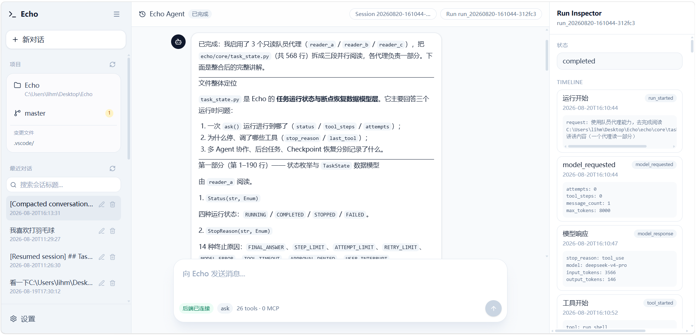

# Echo Agent

Echo is a local-first coding agent framework focused on a reliable synchronous agent loop, structured tools, safe workspace operations, context compaction, session recovery, durable memory, delegation, deterministic evaluation, and white-box visibility into each step of the execution chain.

<p align="center">
  
</p>

## Current Status

Echo currently provides a usable single-agent core with several production-oriented supporting systems:

- Synchronous AgentLoop with native tool-call handling
- Structured tool system with pydantic validation
- Workspace path sandbox and permission hooks
- Environment filtering and secret redaction
- Multi-level context compaction with transcript archival
- Todo, session persistence, checkpoint, and resume support
- Persistent global task graph with dependency blocking, CLI management, and teammate assignment
- Read-only one-shot delegate subagent
- Working memory plus JSON durable memory V1
- Benchmark and evaluation V1 using FakeLLMClient
- Persistent teammate V1 (same-process daemon threads with global task pool and lead inbox injection)
- MCP stdio tool integration from workspace `.echo/mcp.json`

Planned follow-ups: teammate process/worktree isolation, teammate recovery on restart, vector/RAG memory, remote MCP transports, deeper scheduler/background-task integration.

## Quick Start

``bash
pip install -e .
cp .env.example .env
``

Set the provider API key in .env, then run:

``bash
echo-agent "Inspect this project"
``

You can also run the module directly:

``bash
python -m echo "Inspect this project"
``

## Project Layout

``text
echo/
  core/          AgentLoop, TaskState, ContextManager, Echo facade
  tools/         BaseTool, registry, executor, built-in tools
  skills/        workspace-local skill discovery and validation
  providers/     Anthropic, OpenAI, Ollama, and fake clients
  memory/        working memory and durable JSON memory
  persistence/   sessions, runs, trace, reports, checkpoints
  security/      sandboxing, permissions, env filtering, redaction
  hooks/         hook manager and built-in hooks
  multi_agent/   read-only SubAgent plus collaboration primitives
  scheduler/     scheduler primitives
  evaluation/    benchmark tasks, evaluator, metrics

skills/          workspace-local SKILL.md instructions loaded on demand
tests/           unit, integration, regression, and evaluation tests
``

## Built-in Tools

Echo includes file tools, shell execution, search/list helpers, todo management, global task management, context compaction, memory tools, skill loading, and read-only delegation:

- read_file, write_file, patch_file
- glob, grep, list_files
- run_shell
- todo_write, compact
- create_task, get_task, claim_task, complete_task, fail_task
- assign_task, list_global_tasks, wait_global_task
- save_memory, search_memory
- load_skill
- delegate

## MCP Stdio Tools

Echo can load local MCP tools from a workspace-local `.echo/mcp.json` file. The V1 implementation supports Claude Desktop-compatible `mcpServers` configuration with stdio servers only.

Example:

```json
{
  "mcpServers": {
    "demo": {
      "command": "python",
      "args": ["tests/fixtures/demo_mcp_server.py"],
      "env": {
        "DEMO_TOKEN": "test"
      }
    }
  }
}
```

At startup, Echo launches each configured stdio server, initializes it, calls `tools/list`, and registers each remote tool as a normal Echo tool named `mcp_<server>_<tool>`. For example, the demo server's `get_status` tool becomes `mcp_demo_get_status`.

All MCP tool calls require approval by default because Echo registers them with `risk_level = "danger"` and `is_read_only = False`. They flow through the same `PermissionHook`, trace/report artifacts, redaction, truncation, and `ToolResult` handling as built-in tools.

Security notes:

- Treat `.echo/mcp.json` as local, potentially secret-bearing config.
- Do not commit real API tokens. Commit a `.echo/mcp.example.json` instead when a shared example is useful.
- Echo does not pass the full host environment to MCP servers. Only explicit `env` values plus minimal process essentials such as `PATH` are provided.
- V1 supports stdio MCP tools only. HTTP/SSE servers, OAuth flows, MCP resources, MCP prompts, hot reload, and automatic server restart are not included.

## Workspace Skills

Workspace-local skills live in `skills/<skill-name>/SKILL.md`. Echo scans this directory before each active `ask()` or resumed run, injects only a lightweight catalog into the system prompt, and loads full skill instructions on demand through the safe `load_skill` tool.

Each `SKILL.md` may define `name` and `description` in YAML frontmatter:

``markdown
---
name: code-review
description: Review changed code for correctness, maintainability, and test coverage.
---

# Code Review

Full task-specific instructions go here.
``

Skill names are exact registered identifiers, not paths. Names containing `/`, `\\`, `..`, drive prefixes, or empty values are rejected. Symlink skill directories and symlink `SKILL.md` manifests are rejected during scanning and validation.

Manage skills from the CLI:

``bash
python -m echo.cli skills list
python -m echo.cli skills validate
``

## Task System

Echo has two task layers:

- `todo_write` manages the current run's short-term plan in `TaskState.todos`.
- Global tasks are persistent work items stored in `.echo/global/tasks.json` and managed by `GlobalTaskManager`.

Use todos for the model's local checklist during one request. Use global tasks when work should survive across runs, coordinate teammates, or express dependencies.

Global tasks support:

- `pending`, `in_progress`, `completed`, and `failed` statuses
- `owner_agent` assignment
- `blocked_by` dependencies
- completion/failure results
- compact prompt visibility for relevant tasks

CLI examples:

``bash
python -m echo.cli tasks create "Implement parser"
python -m echo.cli tasks create "Write docs" --blocked-by task_ab12cd34
python -m echo.cli tasks list
python -m echo.cli tasks claim task_ab12cd34 --owner lead
python -m echo.cli tasks complete task_ab12cd34 --result "Parser implemented"
python -m echo.cli tasks validate
``

Teammate tasks use the same global task graph. `assign_task` creates a pending task assigned to a teammate; teammate agents claim available assigned tasks, complete or fail them, and report back through the lead inbox.

## Runtime Data

Runtime state is written under .echo/ inside the workspace. This directory contains sessions, runs, traces, reports, checkpoints, transcript archives, large tool outputs, durable memory data, and global tasks in `.echo/global/tasks.json`. It should not be committed.

## Evaluation

Run the deterministic test and benchmark suite with:

``bash
python -B -m pytest tests --ignore=tests/test_providers.py -p no:cacheprovider
``

Provider adapter tests require the optional provider SDK packages to be installed in the local environment.

## Roadmap

1. Keep public documentation aligned with the current implementation
2. Harden persistent teammate runtime: shared LLM locking, restart recovery, process/worktree isolation
3. Add vector/RAG memory V1
4. Add MCP tool integration
5. Expand scheduler/background-task runtime support
